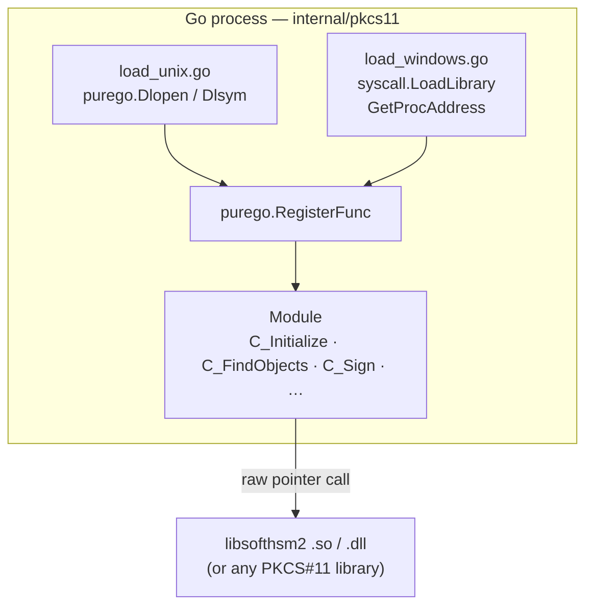
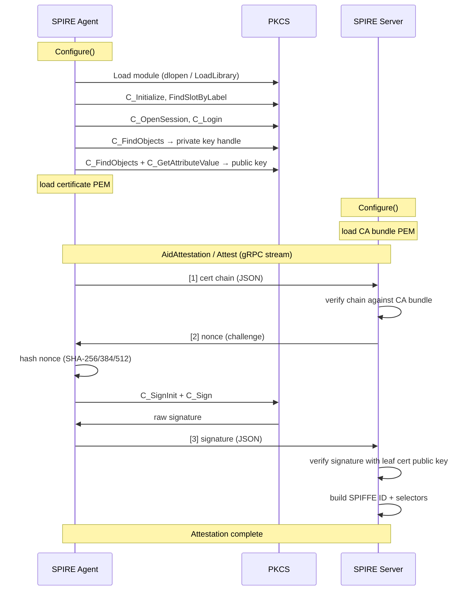

# Architecture

## Overview

This plugin is split into two binaries that communicate with SPIRE over gRPC:

```
nodeattestor-pkcs11-agent   (runs inside SPIRE agent process)
nodeattestor-pkcs11-server  (runs inside SPIRE server process)
```

Both are thin wrappers around the SPIRE Plugin SDK. The agent binary is the interesting one — it holds the PKCS#11 session and signs challenges.

---

## Package structure

```
cmd/
  nodeattestor-pkcs11-agent/   main() — pluginmain.Serve(agent.New())
  nodeattestor-pkcs11-server/  main() — pluginmain.Serve(server.New())

internal/pkcs11/               Pure-Go PKCS#11 client (no CGo)
  pkcs11.go                    Constants, Module struct, slot/token helpers
  signer.go                    Session lifecycle, key lookup, signing, public key extraction
  types_windows.go             Packed CK_ATTRIBUTE / CK_MECHANISM for Windows (16 bytes)
  types_unix.go                Natural CK_ATTRIBUTE / CK_MECHANISM for Unix (24 bytes)
  ck_ulong_windows.go          type CK_ULONG = uint32  (Windows LLP64)
  ck_ulong_unix.go             type CK_ULONG = uint    (Unix LP64)
  load_windows.go              syscall.LoadLibrary / GetProcAddress
  load_unix.go                 purego.Dlopen / Dlsym
  testing.go                   SoftHSM2 test fixture (SetupSoftHSM)

pkg/pkcs11attestor/
  agent/plugin.go              Configure + AidAttestation gRPC handlers
  server/plugin.go             Configure + Attest gRPC handlers
```

---

## No CGo: dynamic library loading

Calling a C shared library from Go normally requires CGo, which needs a C compiler at build time and complicates cross-compilation. This plugin avoids CGo entirely by loading the PKCS#11 library at **runtime** using OS-native dynamic linking APIs.



`purego.RegisterFunc` wraps a raw function pointer into a typed Go function variable. On Windows it uses the Microsoft x64 calling convention; on Unix it uses System V AMD64 ABI. The same Go call site works on all platforms.

---

## Attestation flow



---

## Cross-platform type system

PKCS#11 defines `CK_ULONG` as C `unsigned long`. Its size differs by platform:

| Platform | Data model | `unsigned long` | `CK_ULONG` in this plugin |
|----------|------------|-----------------|---------------------------|
| Linux / macOS 64-bit | LP64 | 8 bytes | `type CK_ULONG = uint` |
| Windows 64-bit | LLP64 | 4 bytes | `type CK_ULONG = uint32` |

Build tags (`//go:build windows` / `//go:build darwin || linux || ...`) select the correct definition at compile time. See [pkcs11_abi.md](pkcs11_abi.md) for the full story including the struct packing issue.

---

## Signing

The plugin supports two key types:

### ECDSA

1. Hash the nonce: SHA-256 (P-256), SHA-384 (P-384), SHA-512 (P-521)
2. `C_SignInit(CKM_ECDSA)` + `C_Sign` → raw `r ‖ s` bytes
3. Convert to ASN.1 DER (`SEQUENCE { INTEGER r, INTEGER s }`)

### RSA PKCS#1 v1.5

1. Hash the nonce with SHA-256
2. Prepend DER-encoded `DigestInfo` structure (RFC 8017 §9.2)
3. `C_SignInit(CKM_RSA_PKCS)` + `C_Sign`

The server plugin uses the same key-type-aware hash selection for verification.

---

## Security considerations

- The private key **never leaves the token**. Only the digest is sent to the HSM for signing.
- The PIN is held in memory only for the duration of `C_Login`. Use `pin_env` in production to avoid storing it in config files.
- Each SPIRE agent holds its own token and certificate. The SPIFFE ID is bound to the SHA-256 fingerprint of the leaf certificate.

---

## Certificate rotation

Because the SPIFFE ID is derived from the SHA-256 fingerprint of the leaf certificate, renewing the certificate changes the SPIFFE ID. The recommended pattern is to interpose a CN/SAN-based registration entry between the agent SPIFFE ID and workload entries, so that workload entries survive certificate rotation without modification.

```
Agent SPIFFE ID  (changes on renewal)
  └── node entry  — selector: subject:cn:<hostname>  ← stable alias
        └── workload entry A
        └── workload entry B
```

**Creating the entries:**

```bash
# 1. Node alias entry — matched by CN, not by certificate fingerprint
spire-server entry create \
  -spiffeID spiffe://example.org/node/prod-node-01 \
  -selector x509pop_pkcs11:subject:cn:prod-node-01 \
  -parentID spiffe://example.org/spire/agent/x509pop_pkcs11/<hash>

# 2. Workload entry — parent is the stable node alias
spire-server entry create \
  -spiffeID spiffe://example.org/workload/db-client \
  -parentID spiffe://example.org/node/prod-node-01 \
  -selector unix:uid:1000
```

**On certificate renewal:**

1. Replace the certificate on the HSM / token.
2. Restart the SPIRE agent.
3. The agent re-attests with a new SPIFFE ID (new fingerprint).
4. The node alias entry re-matches via the CN selector — no entry update needed.
5. All downstream workload entries remain valid.

> **Note:** Keep CN values unique across nodes and issue them from a controlled CA to prevent a compromised node from claiming another node's identity.
