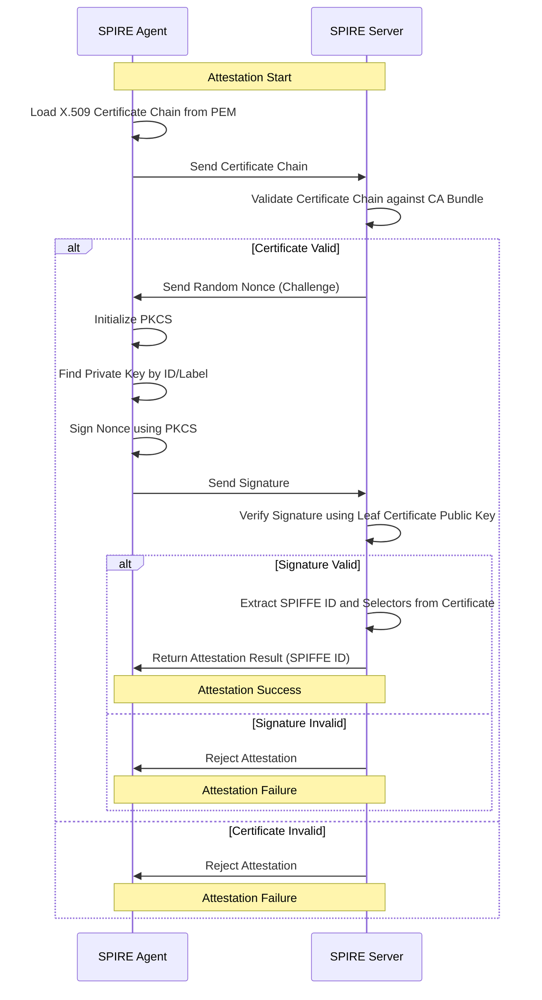

# SPIRE PKCS#11 X.509 POP Node Attestation Sequence Diagram

This sequence diagram illustrates the interaction between the SPIRE Agent and SPIRE Server during the node attestation process for the PKCS#11 X.509 Proof of Possession (POP) plugin.

## Sequence Diagram

## Description

- **Agent Side**: The SPIRE agent loads the X.509 certificate chain, sends it to the server, receives a nonce challenge, signs it using a PKCS#11 token (e.g., SoftHSM or YubiKey), and returns the signature.
- **Server Side**: The SPIRE server validates the certificate chain, sends a nonce, verifies the signature, and issues a SPIFFE ID if successful.
- **Key Features**: Uses PKCS#11 for secure key management and Proof of Possession to ensure the agent possesses the private key corresponding to the certificate.